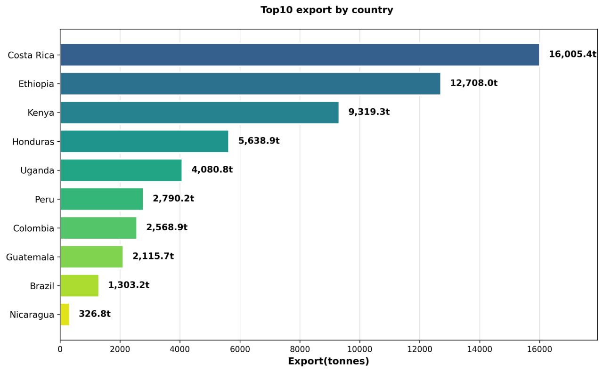
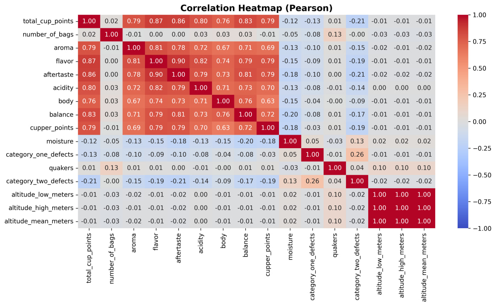
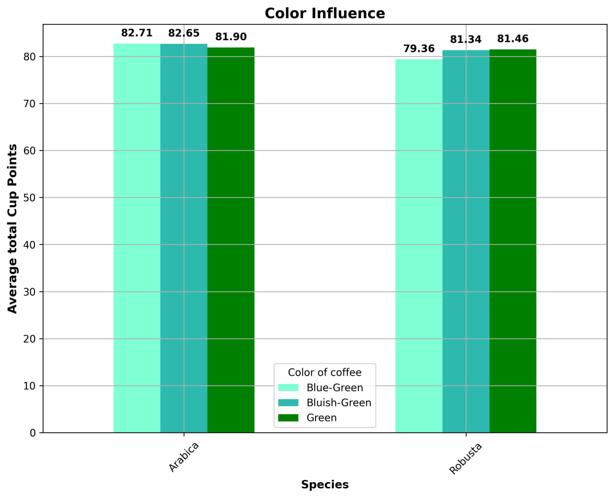
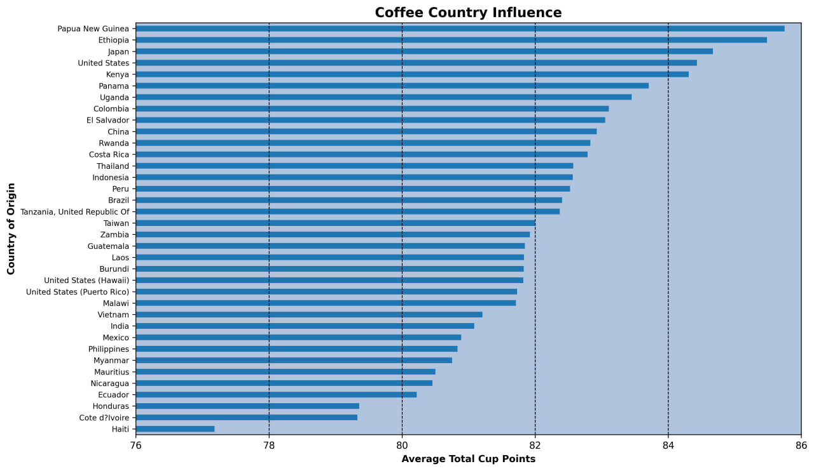
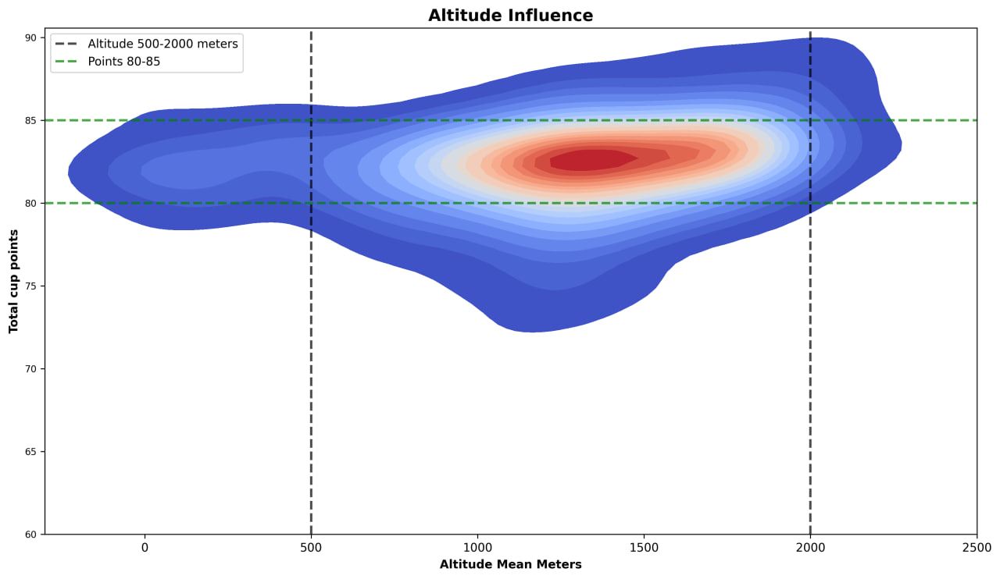

# Coffee Quality Analysis ☕

## Overview
Exploratory data analysis of 1,300+ coffee samples from around the world,
investigating quality factors, export volumes, and altitude influence.

## Questions Explored
- Which countries export the most coffee?
- What attributes correlate most with cup quality?
- How does altitude affect coffee quality?
- Does bean color influence cup points?
- Which country produces the highest quality coffee?

## Key Findings
- Strong correlation found between several quality attributes (Pearson ≥ 0.65)
- Altitude range 500–2000m linked to highest cup points (80–85)
- Significant variation in quality scores by country of origin

## Tools Used
- Python (Pandas, Matplotlib, Seaborn, NumPy)
- Pearson & Spearman correlation methods

## Visualizations
### Top 10 Export Countries

### Correlation Heatmap

### Color Influence

### Coffee Country Influence

### Altitude Influence

## How to Run
pip install -r requirements.txt
python main.py
